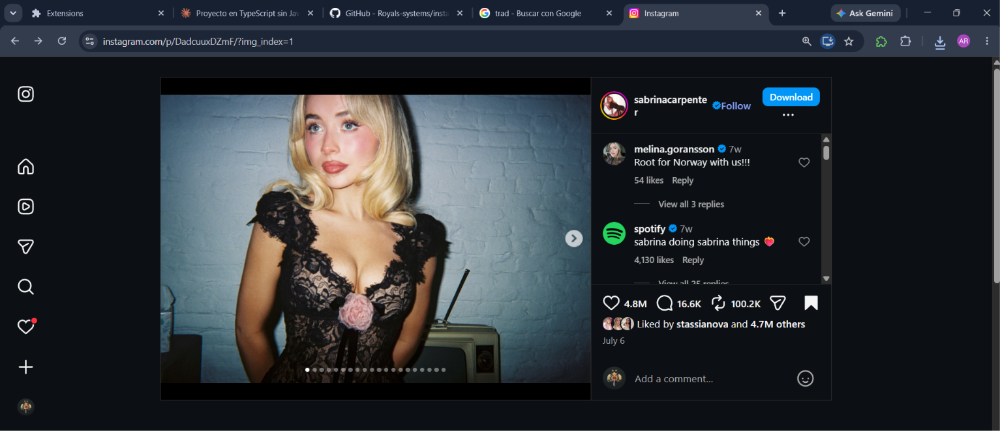
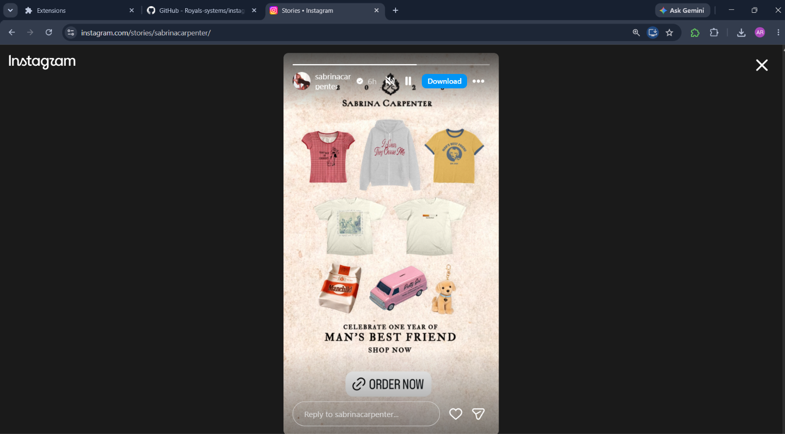

# WXT + React
[wiki](https://github.com/Royals-systems/instagram-downloader/wiki)
This template should help get you started developing with React in WXT.

## fist version: only post
popup version

/post
Next, I'll build it directly in the Instagram card itself.

/reels 

/stories

### important

Do not overuse the download feature, as Instagram limits or even blocks access; therefore, for your own safety, we recommend exercising caution when downloading.